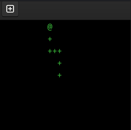

## Задача 1. Выбор направления
Написать функцию, которая будет проверять корректность выбранного направления. Змейка
не может наступать на хвост, поэтому необходимо запретить
○ перемещение справа-налево (при движении RIGHT нажатие стрелки влево),
○ перемещение сверху-вниз (при движении UP нажатие стрелки вниз),
○ перемещение слева-направо (при движении LEFT нажатие стрелки вправо),
○ перемещение снизу-вверх (при движении DOWN нажатие стрелки вверх).  
Функция должна иметь вид:  
int checkDirection(snake_t* snake, int32_t key).

