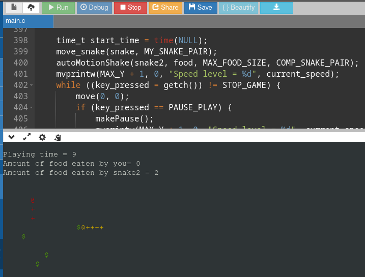

# Урок 5.
## Задание 1. Цвет змеек
Добавить цвет для двух змеек и еды.

## Задание 2. Стартовое меню
Добавить стартовое меню (приветствие, выбор режима, выбор цвета змейки и т.д.).  
Написать функцию void startMenu().

